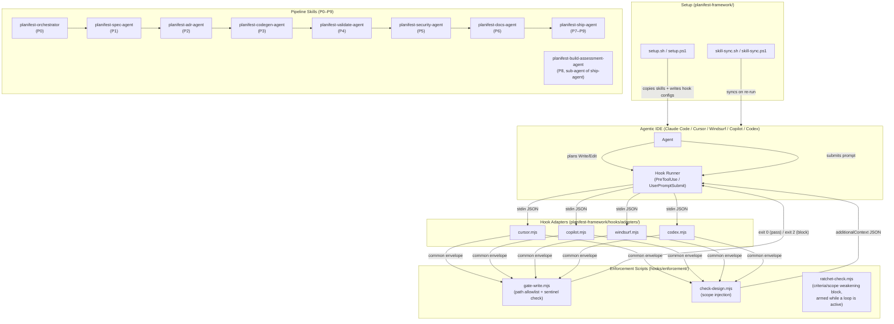

# Architecture Overview

> Living document. Reflects current system state. Updated after every pipeline run.
> Do not archive this file — update it in place.

Last updated: 0000016-pipeline-governance-and-loop-engineering

---

## System Summary

Planifest is a CLI tooling framework that enforces a structured design pipeline for agentic coding agents. It installs enforcement hooks into agentic IDEs (Claude Code, Cursor, Windsurf, GitHub Copilot, Codex) that gate writes to `src/` behind a confirmed design document, and provides a suite of pipeline skills (spec, ADR, codegen, validate, security, docs, ship) that guide development from brief to merged PR.

---

## Components

| Component | Type | Purpose | Status |
|-----------|------|---------|--------|
| `context-mode-hooks` | component-pack | PreToolUse hook scripts blocking Grep, Bash, and WebFetch when context-mode routing rules apply | active |
| `setup-hook-integration` | component-pack | setup.sh/ps1 and skill-sync — installs enforcement hooks, telemetry hooks, context-mode hooks, commit standards, and external skill management into any Planifest-managed project | active |

---

## Communication Patterns

---

## Governance Loops (0000016)

The pipeline has an optional loop layer, entirely toggle-gated via `planifest-overrides/loop-toggles.yml` (absent = all off; zero-config behaviour identical to pre-0000016):

| Loop | Seam | Verifier | Deterministic guard |
|------|------|----------|--------------------|
| P0 completeness | P0 exit | Gate checklist re-evaluated per coaching round | 2-rounds-per-gap escalation |
| Design critic | End of P1/P2 | Fresh-context `planifest-design-critic` (REJECT-default) + `scripts/consistency-check.mjs` | Cap 3, no-progress halt |
| Governed reversal | P3–P6 blocked by upstream P0–P6 artifact | Fresh-context `planifest-reversal-assessor` (DENY-default) | Budget 2/feature, cascade >3 human gate, ratchet-check.mjs on writes |
| Verify-by-execution | P4 after CI | `planifest-verify-by-execution` (runs the software) | Feeds existing P4 cap-5 loop |
| Cross-model review | End of P6, strictly pre-P7-archive | Fresh-context reviewer on a different model id (REJECT-default) | Cap 3; blocks P7 on cap-without-approval |

Shared mechanics (state file, append-only run log, stop rules, escalation format) live in `planifest-loop-runner`. P7 remains the lock line — no loop or reversal touches archived state (`plan/backlog/` is the governed home for deferred work instead).

---

## Data Ownership

No components own persistent data. Planifest operates on local filesystem artifacts (plan/ files, skill SKILL.md files) written and read during pipeline execution. No databases. New in 0000016 (all plain markdown/YAML, git-tracked): `plan/backlog/` entries (orchestrator-owned, filed by any phase agent), `product.yml` (ship-agent writes, orchestrator reads), and `plan/current/` loop-state/run-log/defect-report/revision-log artifacts (orchestrator-owned).

---

## External Dependencies

| Dependency | Type | Components That Use It |
|-----------|------|----------------------|
| Node.js (built-ins only: fs, path, child_process, os, url) | Runtime | All hook adapters and enforcement scripts |
| Bash | Runtime | setup.sh, test scripts, hook install scripts |
| PowerShell 7+ | Runtime | setup.ps1, test_setup.ps1, PowerShell hook scripts |
| git (core.hooksPath) | CLI | setup.sh/ps1 (commit-msg hook installation) |

---

## Key Architectural Decisions

Reference `docs/decisions-index.md` for the full ADR list.

- **ADR-001 (0000003):** Three-tier enforcement model — Claude Code (Tier 1a), other IDEs (Tier 1b), instructions-only (Tier 2)
- **ADR-002 (0000003):** Common envelope shape — all adapters normalise to `{ session_id, cwd, tool_input, event }` before delegating
- **ADR-005 (0000003):** Exit-zero failure mode — hooks never block on unexpected errors (NFR-003)
- **ADR-003 (0000011):** Hook adapter architecture — delegating pattern; adapters translate envelopes, enforcement logic lives only in shared scripts

---

*Template: architecture-overview.template.md*
