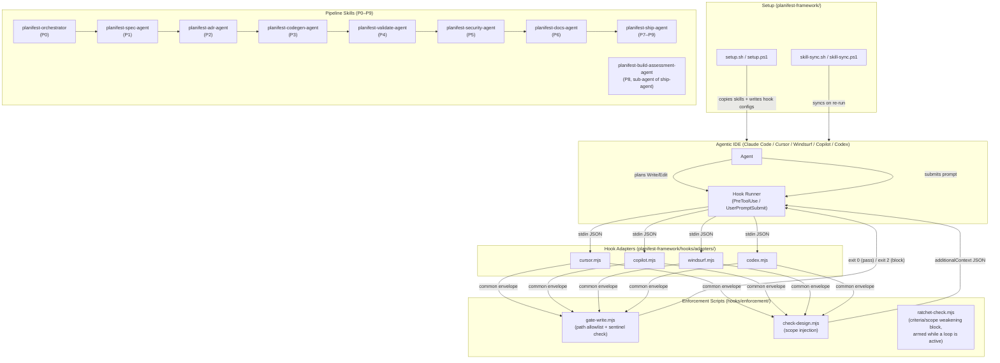

# Architecture Overview

> Living document. Reflects current system state. Updated after every pipeline run.
> Do not archive this file — update it in place.

Last updated: 0000027-backlog-batch-governance-tooling-fixes

---

## System Summary

Planifest is a CLI tooling framework that enforces a structured design pipeline for agentic coding agents. It installs enforcement hooks into agentic IDEs (Claude Code, Cursor, Windsurf, GitHub Copilot, Codex) that gate writes to `src/` behind a confirmed design document, and provides a suite of pipeline skills (spec, ADR, codegen, validate, security, docs, ship) that guide development from brief to merged PR.

---

## Components

| Component | Type | Purpose | Status |
|-----------|------|---------|--------|
| `context-mode-hooks` | component-pack | PreToolUse hook scripts blocking Grep, Bash, and WebFetch when context-mode routing rules apply | active |
| `setup-hook-integration` | component-pack | setup.sh/ps1 and skill-sync — installs enforcement hooks, telemetry hooks, context-mode hooks, commit standards, external skill management, and (0000020) a per-tool flags-used marker into any Planifest-managed project | active |
| `planifest-refresh-setup` | skill (standalone, not a src/ component) | Detects a Planifest install's target tool, reconstructs the setup flags in effect from the flags-used marker or hook wiring, confirms with the human on the loop, and safely re-invokes setup.sh/setup.ps1; see `planifest-framework/skills/planifest-refresh-setup/SKILL.md` | active |

---

## Communication Patterns

---

## Governance Loops (0000016)

The pipeline has an optional loop layer, entirely toggle-gated via `planifest-overrides/loop-toggles.yml` (absent = all off; zero-config behaviour identical to pre-0000016):

| Loop | Seam | Verifier | Deterministic guard |
|------|------|----------|--------------------|
| P0 completeness | P0 exit | Gate checklist re-evaluated per coaching round | 2-rounds-per-gap escalation |
| Design critic | End of P1/P2 | Fresh-context `planifest-design-critic` (REJECT-default) + `scripts/consistency-check.mjs` | Cap 3, no-progress halt |
| Governed reversal | P3–P6 blocked by upstream P0–P6 artifact | Fresh-context `planifest-reversal-assessor` (DENY-default) | Budget 2/feature, cascade >3 human gate, ratchet-check.mjs on writes |
| Verify-by-execution | P4 after CI | `planifest-verify-by-execution` (runs the software) | Feeds existing P4 cap-5 loop |
| Cross-model review | End of P6, strictly pre-P7-archive | Fresh-context reviewer on a different model id (REJECT-default) | Cap 3; blocks P7 on cap-without-approval |

Shared mechanics (state file, append-only run log, stop rules, escalation format) live in `planifest-loop-runner`. P7 remains the lock line — no loop or reversal touches archived state (`plan/backlog/` is the governed home for deferred work instead).

---

## Telemetry (0000018)

Telemetry emission is gated by one unified signal — `--structured-telemetry-mcp` passed to `setup.sh`/`setup.ps1` — which alone wires the 3 hook-driven emitters (`hooks/telemetry/emit-phase-start.mjs`, `emit-phase-end.mjs`, `context-pressure.mjs`) and writes the `.claude/telemetry-enabled` sentinel that agent-driven `emit_event` calls check. Prior to 0000018, hook installation additionally required `--context-mode-mcp`, an unrelated AND-condition that silently left telemetry unwired for any project passing `--structured-telemetry-mcp` alone (root cause of 0000017's fully-silent telemetry run).

When the signal is active, emission is mandatory, not best-effort:
- **Hook-driven failures** stay fire-and-forget (ADR-005, 0000003, unchanged — never blocks the session) but now write a durable JSON marker to `plan/.telemetry-failures/<hook>--<error_type>--<slug>.json` instead of swallowing the error with no trace.
- **`planifest-orchestrator`** checks for markers at the start of every phase (P0–P9) and surfaces a block-or-proceed question to the human once per distinct root cause per run, recording the answer as a `Telemetry` field in the active `build-log.md` phase block.
- **Agent-driven failures** (any phase skill's direct `emit_event` call) stop and ask the same question inline, in the same turn — no marker involved.

**`product_id` sourcing (0000024):** every event's `product_id` is sourced from `product.yml`'s `id` field — a durable, human-declared identity, confirmed by the orchestrator at P0 (hard-stop prompt if absent). There is no filesystem-path fallback: an absent, unparseable, or `id`-less `product.yml` is treated as an emission failure and routed through the same failure-marker mechanism described above, never a silent path-shaped value. `product.yml` now applies to single-component projects too for this purpose (extends 0000016 ADR-002 — see `docs/decisions-index.md`), distinct from its pre-existing multi-component versioning role.

**`emit_event` argument name (0000024):** the MCP tool's top-level call argument is `envelope`, not `event` — this was silently broken for every agent-driven call (12 of 14 event types) since `structured-telemetry-mcp` renamed the argument; only hook-driven `phase_start`/`phase_end`/`context_pressure` (which POST directly via HTTP, bypassing this MCP tool) were unaffected. Fixed and live-reverified this feature (0000017's RCA follow-up, previously unexecuted).

Full protocol and event envelope: `planifest-framework/standards/telemetry-standards.md`.

---

## Data Ownership

No components own persistent data. Planifest operates on local filesystem artifacts (plan/ files, skill SKILL.md files) written and read during pipeline execution. No databases. New in 0000016 (all plain markdown/YAML, git-tracked): `plan/backlog/` entries (orchestrator-owned, filed by any phase agent), `product.yml` (ship-agent writes, orchestrator reads), and `plan/current/` loop-state/run-log/defect-report/revision-log artifacts (orchestrator-owned). New in 0000020 (local, gitignored, not version-tracked): `<tool-dir>/.planifest-setup-flags`, owned by `setup-hook-integration`, written on every successful install and read/updated by `planifest-refresh-setup`. New in 0000025 (git-tracked, additive to the 0000020 marker, not a replacement): `planifest-overrides/setup-config/{tool}.md`, one file per AI tool, written by `setup.sh`/`setup.ps1` alongside the existing gitignored marker so the flags/backend-url in effect at install time are versioned and reviewable, not only locally cached.

---

## External Dependencies

| Dependency | Type | Components That Use It |
|-----------|------|----------------------|
| Node.js (built-ins only: fs, path, child_process, os, url) | Runtime | All hook adapters and enforcement scripts |
| Bash | Runtime | setup.sh, test scripts, hook install scripts |
| PowerShell 7+ | Runtime | setup.ps1, test_setup.ps1, PowerShell hook scripts |
| git (core.hooksPath) | CLI | setup.sh/ps1 (commit-msg hook installation) — `hooks/telemetry/*.mjs` no longer depend on `git` (0000024 removed the `git rev-parse --show-toplevel` `product_id` derivation entirely; see Telemetry section above) |

---

## Key Architectural Decisions

Reference `docs/decisions-index.md` for the full ADR list.

- **ADR-001 (0000003):** Three-tier enforcement model — Claude Code (Tier 1a), other IDEs (Tier 1b), instructions-only (Tier 2)
- **ADR-002 (0000003):** Common envelope shape — all adapters normalise to `{ session_id, cwd, tool_input, event }` before delegating
- **ADR-005 (0000003):** Exit-zero failure mode — hooks never block on unexpected errors (NFR-003)
- **ADR-003 (0000011):** Hook adapter architecture — delegating pattern; adapters translate envelopes, enforcement logic lives only in shared scripts
- **ADR-001 (0000018):** Unified telemetry gating — `--structured-telemetry-mcp` alone wires telemetry hooks, removing the `--context-mode-mcp` coupling bug
- **ADR-002 (0000018):** Telemetry failure detection and interactive recovery — durable failure markers plus block-or-proceed prompting, once per distinct root cause per run
- **ADR-003 (0000018):** discovery.md elevated to Hard Limit status — matches build-log.md's Hard Limit 8 enforcement pattern
- **ADR-001 (0000020):** Hardcoded, non-extensible deletion allowlist for the refresh skill, enforced in a dedicated script, not prose alone (P5 security finding)
- **ADR-002 (0000020):** Single marker file (`.planifest-setup-flags`) serves as both install-time record and refresh retry cache, not two separate files
- **ADR-003 (0000020):** Mandatory human confirmation gate before any refresh action, regardless of flag-reconstruction confidence
- **ADR-004 (0000020):** Tool selection is explicit input to the refresh skill, never silently auto-resolved when multiple installs are present
- **ADR-005 (0000020):** No automatic retry on a failed setup re-invocation; retry is always human-initiated
- **ADR-001 (0000024):** `product.yml` extended to single-component projects as the declared `product_id` home for telemetry — extends, not supersedes, 0000016 ADR-002's versioning-only scope
- **ADR-001 (0000025):** Ship-agent PR footer defaults off; restorable only via a `planifest-overrides/instructions/` opt-in file
- **ADR-002 (0000025):** `planifest-overrides/setup-config/{tool}.md` (tracked) is source of truth over the gitignored `.planifest-setup-flags` marker; reconciled on setup/refresh; `.orchestrator-strict` explicitly out of scope
- **ADR-003 (0000025):** Scope Lock Challenge defaults to always-drafted, batch-presented answers — supersedes **ADR-003 (0000017)**, scoped narrowly against `0000014-ADR-008`'s one-question-at-a-time convention (unchanged everywhere else)

---

*Template: architecture-overview.template.md*
