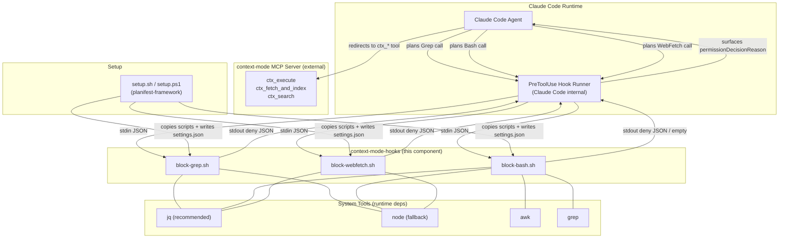

# Dependency Graph

**Last updated:** 2026-04-12
**Maintained by:** planifest-docs-agent

---

## Component Dependency Diagram

---

## Dependency Direction Notes

- `context-mode-hooks` → `jq` / `node` / `awk` / `grep`: runtime shell tools. No build-time imports.
- `context-mode-hooks` → `Claude Code hook runner`: platform dependency. Hook scripts are useless without it.
- `context-mode-hooks` → `context-mode MCP server`: conceptual dependency only. Hooks emit redirect text; they do not call the MCP server directly.
- `setup.sh` → `context-mode-hooks`: installer reads from `planifest-framework/hooks/context-mode/` and copies to target project. One-way.

---

## Planned Components (future pipelines)

| Planned Component | Depends On | Provides |
|-------------------|-----------|---------|
| `mcp-workspace-server` | — | `ctx_workspace_*` tools for multi-repo operations |
| `mcp-context-mode-fork` | `context-mode-hooks` | Forked context-mode MCP with planifest-specific extensions |
