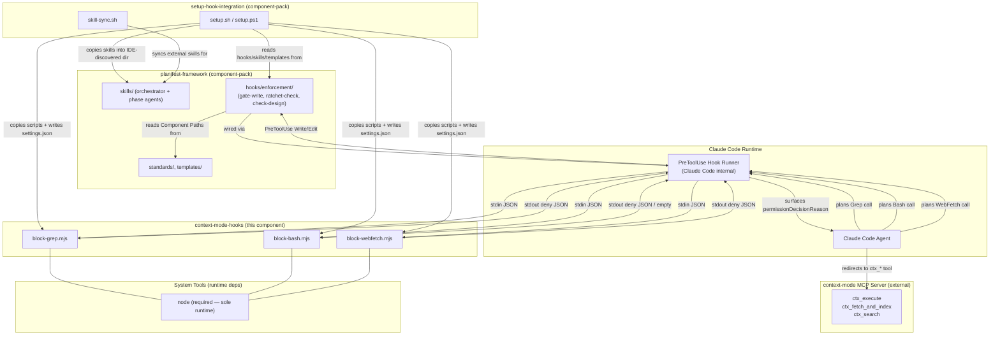

# Dependency Graph

**Last updated:** 0000017-ratchet-forgery-detection-and-telemetry-schema-spec (26 Jul 2026 — context-mode hooks ported to `.mjs`, `jq`/`awk`/`grep` runtime deps removed)
**Maintained by:** planifest-docs-agent

---

## Component Dependency Diagram

```mermaid
graph TD
    subgraph "planifest-framework (component-pack)"
        SKILLS["skills/ (orchestrator + phase agents)"]
        STANDARDS["standards/, templates/"]
        ENFORCE["hooks/enforcement/\n(gate-write, ratchet-check, check-design)"]
    end

    subgraph "Claude Code Runtime"
        CC[Claude Code Agent]
        HookRunner["PreToolUse Hook Runner\n(Claude Code internal)"]
    end

    subgraph "context-mode-hooks (this component)"
        BG["block-grep.mjs"]
        BB["block-bash.mjs"]
        BW["block-webfetch.mjs"]
    end

    subgraph "context-mode MCP Server (external)"
        CTX["ctx_execute\nctx_fetch_and_index\nctx_search"]
    end

    subgraph "setup-hook-integration (component-pack)"
        SH["setup.sh / setup.ps1"]
        SKS["skill-sync.sh"]
    end

    subgraph "System Tools (runtime deps)"
        NODE["node (required — sole runtime)"]
    end

    CC -->|"plans Grep call"| HookRunner
    CC -->|"plans Bash call"| HookRunner
    CC -->|"plans WebFetch call"| HookRunner

    HookRunner -->|"stdin JSON"| BG
    HookRunner -->|"stdin JSON"| BB
    HookRunner -->|"stdin JSON"| BW

    BG -->|"stdout deny JSON"| HookRunner
    BB -->|"stdout deny JSON / empty"| HookRunner
    BW -->|"stdout deny JSON"| HookRunner

    HookRunner -->|"surfaces permissionDecisionReason"| CC
    CC -->|"redirects to ctx_* tool"| CTX

    SH -->|"copies scripts + writes settings.json"| BG
    SH -->|"copies scripts + writes settings.json"| BB
    SH -->|"copies scripts + writes settings.json"| BW
    SH -->|"reads hooks/skills/templates from"| ENFORCE
    SH -->|"copies skills into IDE-discovered dir"| SKILLS
    SKS -->|"syncs external skills for"| SKILLS
    ENFORCE -->|"wired via"| HookRunner
    HookRunner -->|"PreToolUse Write/Edit"| ENFORCE
    ENFORCE -->|"reads Component Paths from"| STANDARDS

    BG --- NODE
    BB --- NODE
    BW --- NODE
```

---

## Dependency Direction Notes

- `context-mode-hooks` → `node`: sole runtime dependency since the 0000017 `.mjs` port (req-004, ADR-002) — `jq`, `awk`, and `grep` removed; parsing and matching are native JavaScript. If Node is missing, setup warns and the wired command fails open with a runtime message.
- `context-mode-hooks` → `Claude Code hook runner`: platform dependency. Hook scripts are useless without it.
- `context-mode-hooks` → `context-mode MCP server`: conceptual dependency only. Hooks emit redirect text; they do not call the MCP server directly.
- `setup-hook-integration` → `context-mode-hooks`: installer reads from `planifest-framework/hooks/context-mode/` and copies to target project. One-way.
- `setup-hook-integration` → `planifest-framework`: `setup.sh`/`setup.ps1` are the sole distribution mechanism — they copy `skills/`, `hooks/enforcement/`, `templates/`, and `standards/` into whichever directory the target agentic tool auto-discovers. One-way; `planifest-framework` has no dependency back on `setup-hook-integration`.
- `planifest-framework`'s `hooks/enforcement/` → Claude Code's PreToolUse hook runner: `gate-write.mjs` and `ratchet-check.mjs` are invoked on every Write/Edit; `ratchet-check.mjs` additionally reads `plan/current/loop-state-*.md` (not shown — not a component, a runtime artifact) to decide whether it is armed.

---

## Planned Components (future pipelines)

| Planned Component | Depends On | Provides |
|-------------------|-----------|---------|
| `mcp-workspace-server` | — | `ctx_workspace_*` tools for multi-repo operations |
| `mcp-context-mode-fork` | `context-mode-hooks` | Forked context-mode MCP with planifest-specific extensions |
