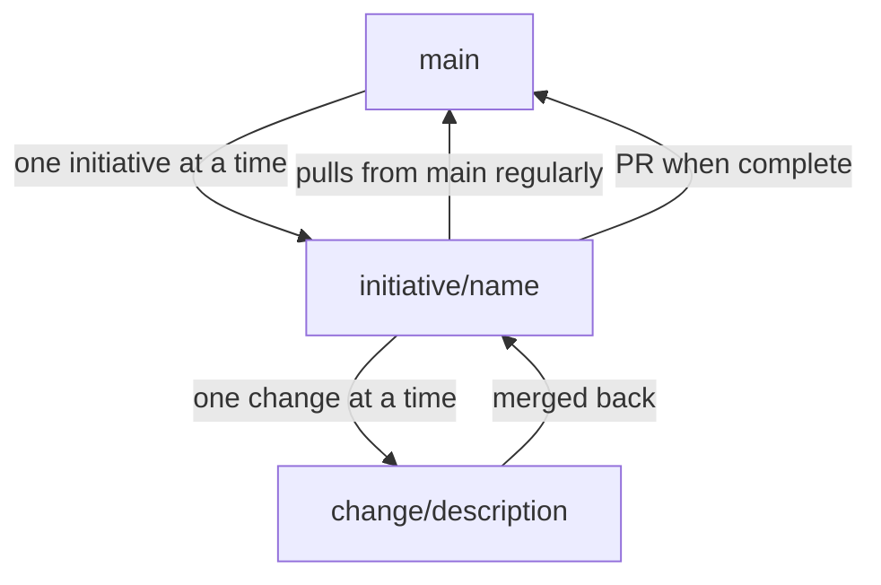

# Planifest — Domain Knowledge Service Reference Implementation

## Version Log

| Version | Change Description | Date | Changed By |
|---|---|---|---|
| 1 | Initial Document | 05 MAR 2026 | Martin Mayer |
| 2 | Deduplicated default rules table — now references canonical table in p003 FD-007 | 07 MAR 2026 | Martin Mayer (via agent) |
| 3 | Added future-state status marker; fixed wikilinks to standard markdown | 07 MAR 2026 | Martin Mayer (via agent) |

---

> **Status: Future architecture.** This document describes the reference implementation of the Domain Knowledge Service MCP server (roadmap items [RC-001](p014-planifest-roadmap.md) and [RC-003](p014-planifest-roadmap.md)). v1.0 operates with the git `docs/` path — agents read and write artifacts directly. The git write model, branching strategy, and serial queue described here become relevant when the service is implemented.

> The Planifest reference implementation of the MCP Domain Knowledge Service. This document describes how Planifest's own specification framework implements the interface — git-backed, serial queue, listener pattern. For the implementation-agnostic interface contract, see [Domain Knowledge Service Interface](p006-planifest-domain-knowledge-service-interface.md).

---

## Purpose

The MCP Domain Knowledge Service gives agents a structured, queryable view of everything Planifest knows about a system. Rather than loading entire documents into context, agents ask targeted questions and receive scoped, purposeful responses.

The service is a thin query layer over the document store. It does not make decisions — it surfaces knowledge. The agent decides what to do with it.

---

## Document Store Schema

Every document in the store conforms to a standard envelope. The content varies by document type; the envelope is always the same.

```typescript
interface DomainDocument {
  id: string                    // e.g. "initiative:auth-service:design-spec"
  type: DocumentType
  scope: DocumentScope
  initiative: string            // initiative identifier
  component?: string            // component identifier, if scoped to one
  version: string               // semver
  createdAt: string             // ISO 8601
  updatedAt: string             // ISO 8601
  author: "human" | "agent"
  status: "draft" | "active" | "superseded" | "archived"
  content: DocumentContent      // typed by DocumentType
  risk: RiskSummary
  scope_boundaries: ScopeBoundaries
  quirks: Quirk[]
}

type DocumentScope = "initiative" | "component" | "system"

type DocumentType =
  | "initiative-brief"
  | "design-spec"
  | "openapi-spec"
  | "adr"
  | "security-report"
  | "risk-register"
  | "scope"
  | "quirks"
  | "recommendations"
  | "operational-model"
  | "slo-definitions"
  | "cost-model"
  | "domain-glossary"
  | "component-purpose"
  | "interface-contract"
  | "dependency-map"
  | "test-coverage"
  | "tech-debt"
  | "component-registry"
  | "dependency-graph"
```

### Cross-cutting Types

These appear in every document regardless of type:

```typescript
interface RiskSummary {
  level: "low" | "medium" | "high" | "critical"
  items: RiskItem[]
}

interface RiskItem {
  id: string
  category: "technical" | "operational" | "security" | "compliance"
  description: string
  likelihood: "low" | "medium" | "high"
  impact: "low" | "medium" | "high"
  mitigation?: string
  status: "open" | "mitigated" | "accepted"
}

interface ScopeBoundaries {
  in: string[]
  out: string[]
  deferred: string[]
}

interface Quirk {
  id: string
  description: string
  workaround?: string
  raisedBy: "human" | "agent"
  raisedAt: string
  status: "open" | "resolved" | "accepted"
}
```

### Key Document Content Types

```typescript
interface ComponentPurpose {
  summary: string               // one-liner: what this component exists to do
  systemContext: string         // where it sits in the wider system
  type: "microservice" | "microfrontend" | "component-pack"
  domain: string                // the domain it belongs to
  responsibilities: string[]
  notResponsibleFor: string[]   // explicit exclusions — equally important
}

interface InterfaceContract {
  inputs: ContractEndpoint[]
  outputs: ContractEndpoint[]
  schema: string                // reference to OpenAPI spec or Zod schema path
  consumedBy: string[]          // component identifiers
  consumes: string[]            // component identifiers
  breakingChangePolicy: string
}

interface ADRContent {
  context: string
  decision: string
  status: "proposed" | "accepted" | "deprecated" | "superseded"
  consequences: string[]
  supersedes?: string           // ADR id
  supersededBy?: string         // ADR id
}

interface ComponentRegistryEntry {
  id: string
  name: string
  type: "microservice" | "microfrontend" | "component-pack"
  summary: string               // one-liner
  initiative: string
  status: "planned" | "active" | "deprecated"
  risk: RiskSummary["level"]
}
```

---

## Document Versioning

Documents are versioned. Updates create new versions rather than overwriting. History is never destroyed — only superseded. This mirrors how the git `docs/` fallback works naturally, and the MCP service versioning model follows the same principle.

```typescript
interface DocumentVersion {
  version: string               // semver
  createdAt: string             // ISO 8601
  author: "human" | "agent"
  changeSummary: string
  previousVersion?: string      // version this supersedes
}
```

The `status` field on `DomainDocument` reflects the current state of a given version: `draft`, `active`, `superseded`, or `archived`. Querying the store always returns the `active` version unless a specific version is requested.

---

## MCP Tools

The service exposes the following tools to agents.

---

### `domain_query`

The primary tool. Ask a natural language question about the domain; receive a structured, scoped answer with source references.

```typescript
// Request
interface DomainQueryRequest {
  question: string              // natural language
  scope?: {
    initiative?: string
    component?: string
    documentTypes?: DocumentType[]
  }
  maxResults?: number           // default: 5
}

// Response
interface DomainQueryResponse {
  answer: string                // synthesised answer in plain language
  confidence: "high" | "medium" | "low"
  sources: DocumentReference[]
  relatedQuestions?: string[]   // suggested follow-up queries
}

interface DocumentReference {
  id: string
  type: DocumentType
  excerpt: string               // the relevant passage
  path: string                  // git docs path as fallback
}
```

**Example:**

```json
// Request
{
  "question": "What components handle authentication?",
  "scope": { "initiative": "platform-v2" }
}

// Response
{
  "answer": "Authentication is handled by the auth-service microservice. It is the sole component responsible for token issuance and validation. The api-gateway consumes it for all inbound requests. No other component performs auth logic — this is an explicit scope boundary in the auth-service design spec.",
  "confidence": "high",
  "sources": [
    {
      "id": "initiative:platform-v2:component:auth-service:purpose",
      "type": "component-purpose",
      "excerpt": "Sole responsibility for token issuance and validation across the platform.",
      "path": "docs/components/auth-service/purpose.md"
    },
    {
      "id": "initiative:platform-v2:component:auth-service:scope",
      "type": "scope",
      "excerpt": "Out of scope: any auth logic in downstream services.",
      "path": "docs/components/auth-service/scope.md"
    }
  ],
  "relatedQuestions": [
    "What are the SLO requirements for the auth-service?",
    "What ADRs exist for the auth strategy?"
  ]
}
```

---

### `get_component`

Retrieve the full domain record for a specific component.

```typescript
// Request
interface GetComponentRequest {
  componentId: string
  include?: DocumentType[]      // default: all
}

// Response
interface GetComponentResponse {
  component: ComponentRegistryEntry
  purpose: ComponentPurpose
  contract: InterfaceContract
  risk: RiskSummary
  scope: ScopeBoundaries
  quirks: Quirk[]
  adrs: ADRContent[]
  techDebt: string[]
}
```

---

### `get_dependency_graph`

Return the dependency graph for an initiative or a named component, to a specified depth.

```typescript
// Request
interface GetDependencyGraphRequest {
  initiative: string
  rootComponent?: string        // if omitted, returns full initiative graph
  depth?: number                // default: 2
}

// Response
interface GetDependencyGraphResponse {
  nodes: ComponentRegistryEntry[]
  edges: DependencyEdge[]
}

interface DependencyEdge {
  from: string                  // component id
  to: string                    // component id
  type: "consumes" | "produces" | "publishes" | "subscribes"
  contract: string              // interface contract id
}
```

---

### `list_adrs`

List ADRs across an initiative or component, optionally filtered by status.

```typescript
// Request
interface ListADRsRequest {
  initiative: string
  component?: string
  status?: ADRContent["status"][]
}

// Response
interface ListADRsResponse {
  adrs: Array<{
    id: string
    title: string
    status: ADRContent["status"]
    decision: string            // one-line summary
    path: string
  }>
}
```

---

### `get_risk`

Surface all risk items for an initiative or component, optionally filtered by level or status.

```typescript
// Request
interface GetRiskRequest {
  initiative: string
  component?: string
  level?: RiskItem["level"][]
  status?: RiskItem["status"][]
}

// Response
interface GetRiskResponse {
  summary: RiskSummary
  items: RiskItem[]
}
```

---

### `get_quirks`

Retrieve all known quirks for a scope, optionally filtered by status.

```typescript
// Request
interface GetQuirksRequest {
  initiative: string
  component?: string
  status?: Quirk["status"][]
}

// Response
interface GetQuirksResponse {
  quirks: Quirk[]
}
```

---

### `raise_issue`

Allows an agent to raise a quirk, risk item, or tech debt entry — not just humans.

```typescript
// Request
interface RaiseIssueRequest {
  initiative: string
  component?: string
  type: "quirk" | "risk" | "tech-debt"
  description: string
  severity?: "low" | "medium" | "high"
  suggestedMitigation?: string
}

// Response
interface RaiseIssueResponse {
  id: string
  status: "logged"
  path: string                  // where it was written in the doc store
  requiresHumanReview: boolean  // true if severity is high or critical
}
```

---

### `get_glossary`

Retrieve the domain glossary for an initiative — the ubiquitous language agents must use when generating code, docs, and specs.

```typescript
// Request
interface GetGlossaryRequest {
  initiative: string
  term?: string                 // lookup a specific term
}

// Response
interface GetGlossaryResponse {
  terms: GlossaryEntry[]
}

interface GlossaryEntry {
  term: string
  definition: string
  aliases?: string[]
  usedIn: string[]              // component ids where this term appears
}
```

---

## Write Tools

The service is symmetric — agents write to the domain knowledge store using the same service they query. Every write produces both a structured record and a markdown file at the corresponding git `docs/` path. The two are always kept in sync.

Agent writes are always flagged with `author: "agent"`. Human reviewers can filter by this to audit what the pipeline has produced.

---

### `create_document`

Create a new document in the store. Validates against the document schema before accepting.

```typescript
// Request
interface CreateDocumentRequest {
  type: DocumentType
  scope: DocumentScope
  initiative: string
  component?: string
  content: DocumentContent
  changeSummary: string
}

// Response
interface CreateDocumentResponse {
  id: string
  version: string
  path: string                  // git docs path
  requiresHumanReview: boolean
}
```

---

### `update_document`

Update an existing document. Creates a new version; the previous version is retained with status `superseded`.

```typescript
// Request
interface UpdateDocumentRequest {
  id: string
  content: Partial<DocumentContent>
  changeSummary: string
}

// Response
interface UpdateDocumentResponse {
  id: string
  previousVersion: string
  newVersion: string
  path: string
  requiresHumanReview: boolean
}
```

---

### `supersede_adr`

Supersede an existing ADR with a new one. Links the old and new ADRs bidirectionally. The old ADR status is set to `superseded`; its history is retained.

```typescript
// Request
interface SupersedeADRRequest {
  supersededId: string          // ADR being replaced
  newAdr: ADRContent
  rationale: string             // why the decision changed
  initiative: string
  component?: string
}

// Response
interface SupersedeADRResponse {
  supersededId: string
  newId: string
  path: string
  requiresHumanReview: boolean  // always true — ADR changes are significant
}
```

---

### `raise_issue`

Allows an agent to raise a quirk, risk item, or tech debt entry — not just humans.

```typescript
// Request
interface RaiseIssueRequest {
  initiative: string
  component?: string
  type: "quirk" | "risk" | "tech-debt"
  description: string
  severity?: "low" | "medium" | "high"
  suggestedMitigation?: string
}

// Response
interface RaiseIssueResponse {
  id: string
  status: "logged"
  path: string
  requiresHumanReview: boolean  // true if severity is high or critical
}
```

---

### `raise_improvement`

Allows an agent to propose an improvement to the system, a component, or the domain model itself. By default, improvements always require human review — they change intent, and only a human can decide whether an improvement becomes an Initiative Brief.

This default is overridable per initiative.

```typescript
// Request
interface RaiseImprovementRequest {
  initiative: string
  component?: string
  title: string
  description: string
  rationale: string             // why this would be better
  effort: "low" | "medium" | "high"
  impact: "low" | "medium" | "high"
  suggestedApproach?: string
  relatedDocuments?: string[]   // document ids
}

// Response
interface RaiseImprovementResponse {
  id: string
  status: "logged"
  path: string
  requiresHumanReview: true     // always by default
}
```

---

## Database Tools

Data is treated differently to code throughout Planifest. A component can be rebuilt freely within its boundary — but the data it owns cannot. Schema changes require explicit migration plans, and certain operations are hard limits regardless of configuration.

### `get_data_contract`

Retrieve the canonical data contract for a component — the authoritative schema definition that the component owns.

```typescript
// Request
interface GetDataContractRequest {
  componentId: string
  initiative: string
}

// Response
interface GetDataContractResponse {
  componentId: string
  owner: string                 // component that owns this data — always one
  schema: DataSchema
  invariants: string[]          // rules the data must always satisfy
  migrations: MigrationSummary[]
}

interface DataSchema {
  tables: TableDefinition[]
  version: string
  path: string                  // path to full schema file
}

interface TableDefinition {
  name: string
  columns: ColumnDefinition[]
  indexes: string[]
  relationships: TableRelationship[]
}

interface ColumnDefinition {
  name: string
  type: string
  nullable: boolean
  default?: string
  constraints: string[]
}

interface TableRelationship {
  type: "one-to-one" | "one-to-many" | "many-to-many"
  targetTable: string
  foreignKey: string
}

interface MigrationSummary {
  id: string
  version: string
  description: string
  appliedAt?: string            // undefined if pending
  status: "pending" | "applied" | "rolled-back"
  destructive: boolean          // true if drops, renames, or type changes are involved
}
```

---

### `get_migration_history`

Return the full migration history for a component's data contract.

```typescript
// Request
interface GetMigrationHistoryRequest {
  componentId: string
  initiative: string
  status?: MigrationSummary["status"][]
}

// Response
interface GetMigrationHistoryResponse {
  componentId: string
  migrations: MigrationSummary[]
  currentSchemaVersion: string
}
```

---

### `propose_migration`

An agent proposes a schema migration before any schema change is applied. The migration plan is written to the doc store and flagged for human review. No schema change is applied until the migration is approved.

```typescript
// Request
interface ProposeMigrationRequest {
  componentId: string
  initiative: string
  description: string
  changes: SchemaChange[]
  rationale: string
  rollbackPlan: string
}

interface SchemaChange {
  type: "add-column" | "add-table" | "add-index"
       | "modify-column" | "rename-column" | "rename-table"
       | "drop-column" | "drop-table"
  target: string                // table or column name
  detail: string
  destructive: boolean
}

// Response
interface ProposeMigrationResponse {
  id: string
  status: "proposed"
  path: string
  requiresHumanReview: true     // always — no exceptions
  hardLimit: boolean            // true if destructive operations are present
}
```

---

## Query Conventions

**Agents should query before generating.** Before building a component, the agent should at minimum:

1. `get_component` — understand what already exists in the vicinity
2. `domain_query` — confirm there is no existing component with overlapping responsibility
3. `get_risk` — understand what risk has already been identified for this domain
4. `get_glossary` — confirm it is using the correct ubiquitous language

**Queries should be scoped.** Unscoped queries return noisier results. Always pass `initiative` at minimum; pass `component` when working within a known boundary.

**Confidence matters.** A `low` confidence response means the domain knowledge store does not have a reliable answer. The agent should flag this rather than infer — and may raise an issue via `raise_issue` to surface the gap.

---

## Git `docs/` Path

For teams not running the MCP service, agents read documents directly from the git repository. The folder structure mirrors the document store schema, so agents can navigate it without the query service. No additional infrastructure is required.

This path suits smaller teams, single initiatives, or environments where running an additional service is not desirable. Both paths produce and consume the same document structure and honour the same default rules. The choice is operational, not architectural.

```
docs/
├── design-spec.md
├── openapi-spec.yaml
├── domain-glossary.md
├── risk-register.md
├── scope.md
├── quirks.md
├── recommendations.md
├── operational-model.md
├── slo-definitions.md
├── cost-model.md
├── adr/
│   └── 001-auth-strategy.md
├── components/
│   └── {component-id}/
│       ├── purpose.md
│       ├── interface-contract.md
│       ├── dependencies.md
│       ├── risk.md
│       ├── scope.md
│       ├── quirks.md
│       ├── tech-debt.md
│       ├── data-contract.md
│       ├── migrations/
│       │   └── 001-initial-schema.md
│       └── adr/
└── system/
    ├── component-registry.md
    └── dependency-graph.md
```

---

## Git Write Model

The MCP service is the sole writer to the git monorepo — for both code and docs. Agents never write to git directly. All writes are posted to the MCP service and queued for processing.

### Queue and Listener

When an agent posts an update, it is placed on a write queue. A listener processes the queue and triggers a function to commit and push the change. The queue is processed serially — one write at a time, in order. This eliminates merge conflicts by design.

### Branching Strategy



- **`main`** — the stable trunk. Agents never write here directly. Only merged into via PR.
- **`initiative/{name}`** — one branch per initiative, taken from main. One initiative is worked on at a time.
- **`change/{description}`** — each individual change is made on a branch off the initiative branch. One change at a time. Merged back into the initiative branch when complete.

Initiative branches pull from main regularly to stay current. This is a precaution — in normal operation there should be nothing to pull in, because the MCP service is the only writer.

### Atomic Commits

Code and docs are committed together in a single operation. A component without its documentation, or documentation without its code, is never a complete committed state.

### Conflict Prevention

Conflicts should not occur under normal operation. The serial queue, single-writer model, and one-change-at-a-time discipline make concurrent writes impossible within the pipeline.

Conflicts would only arise if:
- A human pushes directly to git outside the MCP service
- A secondary agentic system writes to git directly

Both are outside the Planifest model. Teams should treat direct git pushes by humans or external systems as a process violation during active pipeline operation.

---

## Non-MCP Git Path

For teams not running the MCP service, agents interact with git directly using the local environment. No custom infrastructure is required.

### Credential Handling

Credentials are never passed to or through the agent. The agent invokes git as a local process; the OS handles authentication natively:

- **macOS** — Keychain
- **Windows** — Windows Credential Manager
- **Linux** — git credential store or libsecret

In CI environments (GitHub Actions, GitLab CI etc.), credentials are injected as masked environment variables consumed by the git process directly. They are never present in the agent's context.

The agent is given a capability — "you can commit to git" — not a credential. It cannot share, leak, or expose authentication details regardless of how it is prompted, because they are not available to it.

### Behaviour

The same branching strategy and serial discipline applies as in the MCP path — one initiative branch, one change branch at a time, code and docs committed atomically. The difference is that the queue and listener are not present — the agent commits directly in sequence as part of its pipeline execution.

The non-MCP path is appropriate for:
- Local development
- Smaller teams with simpler workflows
- Environments where running an additional service is not desirable

These rules govern how the service and the agents using it behave. See [FD-007 — Default rules](p003-planifest-functional-decisions.md#fd-007--default-rules-are-conservative-autonomy-is-earned-progressively) for the full default rules table. Rules marked **overridable** can be changed per initiative. Rules marked **hard limit** cannot — the consequences of getting them wrong are irreversible.

---

*Related: [Master Plan](p001-planifest-master-plan.md) | [The Pathway to Agentic Development](p004-the-pathway-to-agentic-development.md) | [Domain Knowledge Service Interface](p006-planifest-domain-knowledge-service-interface.md) | [Roadmap](p014-planifest-roadmap.md)*
