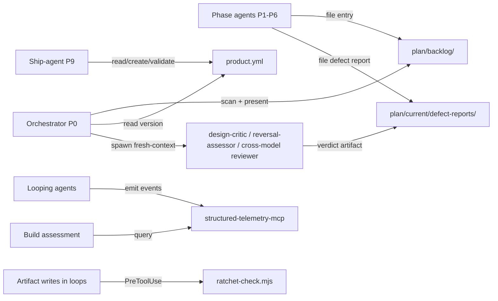

# Execution Plan - Pipeline Governance and Loop Engineering

> Written by the spec-agent. Derived from the Feature Brief - not invented. Every requirement must be traceable to a user story or acceptance criterion.

**Skill:** [spec-agent](../../planifest-framework/skills/planifest-spec-agent/SKILL.md)
**Tool:** claude-code
**Model:** claude-fable-5
**Feature:** 0000016-pipeline-governance-and-loop-engineering
**Wave:** 0 and 1 (single pipeline run, per-wave Ships When gates)
**Version:** 0.16.0 (working recommendation — final confirmation at P3)
**Status:** active

---

## Active Skills

Capability skills loaded for this pipeline run (populated by orchestrator at P0).

| Skill | Scope | Purpose |
|-------|-------|---------|
| (none) | — | No external capability skills relevant to this framework/tooling feature |

---

## Functional Requirements Directory

Functional requirements are split into individual files — one user story per file — at `plan/current/requirements/`.

### Wave 0 — governance foundations

| File | Requirement |
|------|------------|
| [req-001-backlog-folder.md](requirements/req-001-backlog-folder.md) | `plan/backlog/{id}-{slug}/` convention + entry template |
| [req-002-backlog-pickup-p0.md](requirements/req-002-backlog-pickup-p0.md) | P0 scans backlog, presents entries one at a time |
| [req-003-product-manifest.md](requirements/req-003-product-manifest.md) | `product.template.yml` with `versionPolicy` (3 values) |
| [req-004-ship-agent-product-tagging.md](requirements/req-004-ship-agent-product-tagging.md) | P9 tags from `product.yml`, single-component fallback |
| [req-005-orchestrator-product-version-detection.md](requirements/req-005-orchestrator-product-version-detection.md) | P0 version suggestion reads `product.yml` |
| [req-006-phase-to-wave-terminology.md](requirements/req-006-phase-to-wave-terminology.md) | Decomposition "Phase" → "Wave" rename |
| [req-007-fine-grained-commits.md](requirements/req-007-fine-grained-commits.md) | Commit after every meaningful artifact write |
| [req-008-push-cadence.md](requirements/req-008-push-cadence.md) | Push feature branch after phase-gate commits when authorized |

### Wave 1 — loop engineering

| File | Requirement |
|------|------------|
| [req-009-loop-runner-skill.md](requirements/req-009-loop-runner-skill.md) | Canonical loop mechanics skill |
| [req-010-loop-state-run-log.md](requirements/req-010-loop-state-run-log.md) | Loop-state file + append-only run log |
| [req-011-loop-telemetry-toggles.md](requirements/req-011-loop-telemetry-toggles.md) | 4 new event types + per-loop toggles (default off) |
| [req-012-p0-completeness-loop.md](requirements/req-012-p0-completeness-loop.md) | Checklist-driven P0 exit loop |
| [req-013-design-critic-skill.md](requirements/req-013-design-critic-skill.md) | Fresh-context REJECT-default critic (report-only) |
| [req-014-consistency-check-script.md](requirements/req-014-consistency-check-script.md) | Deterministic cross-artifact consistency script |
| [req-015-design-defect-report.md](requirements/req-015-design-defect-report.md) | Structured defect-report artifact |
| [req-016-reversal-assessor-skill.md](requirements/req-016-reversal-assessor-skill.md) | Fresh-context REJECT-default reversal assessor |
| [req-017-governed-reversal-execution.md](requirements/req-017-governed-reversal-execution.md) | Scoped correction: rev-bump, cascade, forward resume |
| [req-018-ratchet-hook.md](requirements/req-018-ratchet-hook.md) | `ratchet-check.mjs` blocks silent weakening |
| [req-019-reversal-human-gates.md](requirements/req-019-reversal-human-gates.md) | Always-stop gates no run mode can bypass |
| [req-020-verify-by-execution.md](requirements/req-020-verify-by-execution.md) | P4 verifies criteria by running the software |
| [req-021-cross-model-review-gate.md](requirements/req-021-cross-model-review-gate.md) | Different-model REJECT-default review before P7 |

Delivered ahead of P1 (should-have, committed 8b6a7da during P0): executable-bit fix on tracked hook scripts + `.DS_Store` gitignore entry. No requirement file — recorded in scope.

---

## Non-Functional Requirements

| ID | Category | Requirement | Target | Measurement |
|----|----------|------------|--------|-------------|
| NFR-001 | Trust | No loop can weaken criteria/scope without explicit human approval | 100% of seeded weakening writes blocked | Ratchet hook unit tests + attempted-weakening telemetry |
| NFR-002 | Zero-regression default | With all toggles off, pipeline behaviour identical to pre-feature | Byte-identical artifacts on a reference run | Toggles-off comparison run |
| NFR-003 | Compatibility | Single-component P9 tagging unchanged for this repo | Existing Step-8 tagging tests pass unmodified | Framework test suite |
| NFR-004 | Cost visibility | Every loop iteration and reversal attributable in telemetry | 100% of iterations produce a `loop_iteration` event when enabled | P8 build assessment per-loop counts |
| NFR-005 | Auditability | Every reversal reconstructable from artifacts alone | Report → verdict → revisions → cascade → gate chain complete | Manual audit of first live reversal |

---

## API Summary

Not applicable — component-pack with no API surface. No OpenAPI specification is produced (spec-agent conditional rule).

---

## Data Model Summary

No database entities. All data is plain markdown/YAML files in the repo:

| Entity | Owner Component | Key Fields | Relationships |
|--------|----------------|------------|--------------|
| Backlog entry (`plan/backlog/{id}-{slug}/`) | planifest-framework (orchestrator) | problem, source feature/phase, date filed | consumed at next P0 pickup |
| `product.yml` | planifest-framework (ship-agent writes) | id, name, version, versionPolicy, feature, components[] | read by orchestrator P0 |
| Loop state + run log (`plan/current/`) | planifest-framework (orchestrator) | iteration counter, cap, budget, per-iteration records | referenced by defect reports/verdicts |
| Defect report + verdict (`plan/current/defect-reports/`) | planifest-framework (orchestrator) | blockage, binding artifact, evidence, grant/deny | drives revision-log + cascade |
| Telemetry events | structured-telemetry-mcp | envelope + `loop_iteration`, `phase_reversal_*` | queried by P8 |

---

## Component Interactions

---

## Assumptions

| ID | Assumption | Impact if Wrong |
|----|-----------|----------------|
| A-001 | Existing req↔component↔test traceability suffices to compute invalidation cascades | Cascade computation needs new metadata — added scope in Wave 1 |
| A-002 | Telemetry envelope extends to loop events without schema redesign | Telemetry work grows into a schema migration |
| A-003 | This repo's `component.yml`-only tagging remains valid as single-component fallback | This repo's own P9 tagging breaks when product.yml logic lands |
| A-004 | A "different model id" reviewer is resolvable from the tier table in every supported tool | Cross-model gate degrades to same-model fresh-context review (recorded in verdict) |

---

## Open Questions

| ID | Question | Blocking |
|----|----------|----------|
| Q-001 | Location/format of the per-loop toggle file (settings vs. planifest-overrides) | ADR at P2; blocks REQ-011 implementation detail only |
| Q-002 | Human-approval marker mechanism for intentional weakening past the ratchet | ADR at P2; blocks REQ-018 implementation detail only |
| Q-003 | Cascade-size threshold that forces a human gate | ADR at P2; blocks REQ-019 implementation detail only |
| Q-004 | Make feature-branch push standing in custom-001 override, or keep per-session? | Human decision at P3 (deferred from P0) |

---

*Generated by spec-agent. See [Orchestrator Skill](../../planifest-framework/skills/planifest-orchestrator/SKILL.md)*
