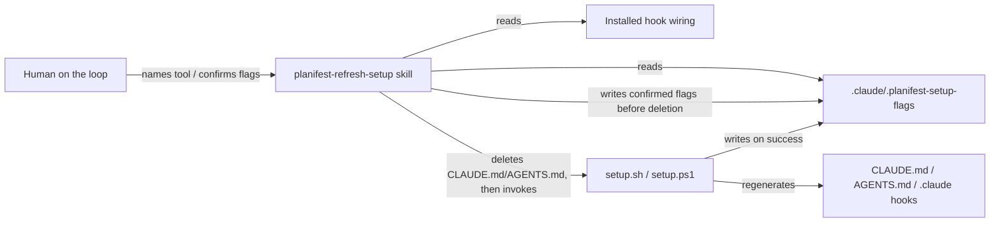

# Execution Plan - Setup Refresh Skill

> Written by the spec-agent. Derived from the Feature Brief - not invented. Every requirement must be traceable to a user story or acceptance criterion.

**Skill:** [spec-agent](../../planifest-framework/skills/planifest-spec-agent/SKILL.md)
**Tool:** claude-code
**Model:** claude-sonnet-4-6
**Feature:** 0000020-setup-refresh-skill
**Wave:** 1 (single wave)
**Version:** 0.20.0
**Status:** active

---

## Active Skills

No capability skills loaded for this pipeline run (none relevant to this stack. Bash/PowerShell/Markdown skill authoring).

---

## Functional Requirements Directory

| File | Requirement |
|------|------------|
| [req-001-tool-input-and-detection.md](requirements/req-001-tool-input-and-detection.md) | Skill accepts/asks for the target tool up front |
| [req-002-flag-reconstruction-with-confidence.md](requirements/req-002-flag-reconstruction-with-confidence.md) | Reconstructs active flags from marker file or hook wiring, with confidence |
| [req-003-human-confirmation-gate.md](requirements/req-003-human-confirmation-gate.md) | Human on the loop always confirms the flag set before any destructive action |
| [req-004-safe-boot-file-deletion.md](requirements/req-004-safe-boot-file-deletion.md) | Deletes only `CLAUDE.md`/`AGENTS.md`, never user-owned files |
| [req-005-reinvoke-setup-with-confirmed-flags.md](requirements/req-005-reinvoke-setup-with-confirmed-flags.md) | Re-invokes `setup.sh`/`setup.ps1` with confirmed flags |
| [req-006-setup-failure-handling.md](requirements/req-006-setup-failure-handling.md) | Stops, investigates cause, prints command, relies on cache on setup failure |
| [req-007-no-install-found-handling.md](requirements/req-007-no-install-found-handling.md) | Reports and stops when no Planifest install exists for the target |
| [req-008-install-time-marker-write.md](requirements/req-008-install-time-marker-write.md) | `setup.sh`/`setup.ps1` write `.claude/.planifest-setup-flags` at install time, in parity |
| [req-009-marker-write-before-deletion.md](requirements/req-009-marker-write-before-deletion.md) | Refresh skill writes confirmed flags/command to the marker before deleting anything |
| [req-010-cross-session-recovery.md](requirements/req-010-cross-session-recovery.md) | Recovers from an interrupted prior run via the marker file |

---

## Non-Functional Requirements

This is a local CLI/dev-tooling skill, no latency/availability/throughput targets apply (see confirmed design, Architecture Layer). The binding non-functional requirements are safety and correctness:

| ID | Category | Requirement | Target | Measurement |
|----|----------|------------|--------|-------------|
| NFR-001 | Safety | Never delete or modify `settings.local.json` or any file outside the `CLAUDE.md`/`AGENTS.md` deletion allowlist | Zero unauthorised writes across every refresh run | Test asserts file mtimes/contents of `settings.local.json` and other non-allowlisted files are unchanged after a refresh run (REQ-004) |
| NFR-002 | Correctness | Never run setup with a reconstructed flag set the human on the loop has not explicitly confirmed | 100% of runs pass through the confirmation gate, including all-high-confidence runs | Test asserts no deletion/re-invocation call occurs without a preceding confirmation event (REQ-003) |
| NFR-003 | Recoverability | An interrupted run (process killed between confirmation and setup completion) must be recoverable without repeating flag detection | Recovery reads the marker file, not hook wiring, on a detected interruption | Test simulates a kill between REQ-009's write and REQ-005's completion, then asserts the next run reads the marker instead of re-detecting (REQ-010) |

> No performance/latency/throughput NFRs apply, this is a local CLI tool, not a service.

---

## API Summary

Not applicable, this feature does not expose or consume an HTTP API. No OpenAPI specification is produced (spec-agent rule: omit for non-API components).

---

## Data Model Summary

| Entity | Owner Component | Key Fields | Relationships |
|--------|----------------|------------|--------------|
| Setup flags marker (`.claude/.planifest-setup-flags`) | `setup-hook-integration` | `tool`, `flags[]`, `backendUrl` (if telemetry flag set), `writtenAt`, `attemptStatus` (`completed` \| `pending`) | Written by `setup.sh`/`setup.ps1` (REQ-008) and by `planifest-refresh-setup` before deletion (REQ-009); read by `planifest-refresh-setup` for reconstruction (REQ-002) and recovery (REQ-010) |

Full schema: [src/setup-hook-integration/docs/data-contract.md](../../src/setup-hook-integration/docs/data-contract.md)

---

## Component Interactions

---

## Assumptions

| ID | Assumption | Impact if Wrong |
|----|-----------|----------------|
| A-001 | Installed hook wiring in `.claude/settings.json` (and each tool's equivalent config) reliably signals which flags were used at install time | Reconstruction confidence is lower than expected; more runs require human confirmation of a lower-confidence set, which is the designed fallback, not a failure |
| A-002 | `.claude/.planifest-setup-flags`, once present and complete, is preferred over hook-wiring inference without a staleness check against current hook wiring | If a human hand-edits hook wiring without re-running setup, the marker could report a flag set that no longer matches installed state; out of scope for this feature (no staleness reconciliation), flagged in risk register |

---

## Open Questions

None, all material gaps were resolved during the P0 Scope Lock Challenge (see `plan/current/build-log.md`).

---

*Generated by spec-agent. See [Orchestrator Skill](../../planifest-framework/skills/planifest-orchestrator/SKILL.md)*
