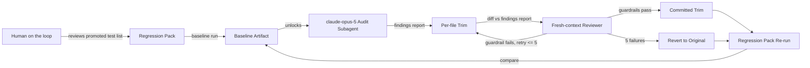

# Execution Plan - Framework Context Bloat Audit

> Written by the spec-agent. Derived from the Feature Brief - not invented. Every requirement must be traceable to a user story or acceptance criterion.

**Skill:** [spec-agent](../../planifest-framework/skills/planifest-spec-agent/SKILL.md)
**Tool:** Claude Code
**Model:** claude-sonnet-5 (spec-agent); claude-opus-5 (req-002 audit subagent, model-tier override)
**Feature:** 0000021-framework-context-bloat-audit
**Wave:** 1 (single wave)
**Version:** 0.21.0
**Status:** active

---

## Active Skills

None — `planifest-framework/skills-inbox/` is empty.

---

## Functional Requirements Directory

| File | Requirement |
|------|------------|
| [req-001-populate-regression-pack-baseline.md](requirements/req-001-populate-regression-pack-baseline.md) | Populate the regression pack and record a baseline before any audit or trim work begins |
| [req-002-opus5-audit-findings-report.md](requirements/req-002-opus5-audit-findings-report.md) | Fresh-context `claude-opus-5` audit pass producing a written findings report |
| [req-003-guardrailed-trim-with-retry.md](requirements/req-003-guardrailed-trim-with-retry.md) | Per-file trim with dual-guardrail review and a 5-attempt failure-informed retry before reverting |
| [req-004-regression-rerun-baseline-comparison.md](requirements/req-004-regression-rerun-baseline-comparison.md) | Re-run the regression pack after trimming and compare against the recorded baseline |

---

## Non-Functional Requirements

| ID | Category | Requirement | Target | Measurement |
|----|----------|------------|--------|-------------|
| NFR-001 | Context efficiency | Reduce total line count across `planifest-framework/skills/*/SKILL.md` | ≥20% reduction from the 3,959-line baseline, floor only, no fixed ceiling — audit-driven per file | Per-file and aggregate line counts recorded in the changelog (req-004) |
| NFR-002 | Content integrity | Zero loss of Hard-Limit, STOP-gate, or enforcement-referenced instructions | 100% preserved, verified per file | Second fresh-context reviewer diff against the findings report (req-003) |
| NFR-003 | Behavioral stability | No increase in agent confusion, retries, or escalated "doom loops" caused by the trim | No new regression-pack failures and no rise in self-correction/escalation count versus the req-001 baseline | Regression pack re-run + baseline comparison (req-004) |

---

## API Summary

Not applicable — no API surface in this feature.

---

## Data Model Summary

Not applicable — no data store; all artifacts are markdown/bash files owned by `planifest-framework`.

---

## Component Interactions

---

## Assumptions

| ID | Assumption | Impact if Wrong |
|----|-----------|----------------|
| A-001 | The 29 existing test scripts in `planifest-framework/tests/` are sufficient raw material to promote from for the regression pack | Baseline would need net-new test authoring, extending req-001 before req-002 can start |
| A-002 | `claude-opus-5` is available to this session via the Agent tool's `model` parameter | Audit pass (req-002) degrades to the default primary tier with a build-log note |
| A-003 | Trimming is achievable at the line/paragraph level without file restructuring | Some files may need light restructuring (not full router decomposition) to hit the 20% floor safely; flagged to human if encountered |

---

## Open Questions

None — the Scope Lock Challenge and design confirmation resolved all material ambiguity for this feature before P1 began.

---

*Generated by spec-agent. See [Orchestrator Skill](../../planifest-framework/skills/planifest-orchestrator/SKILL.md)*
