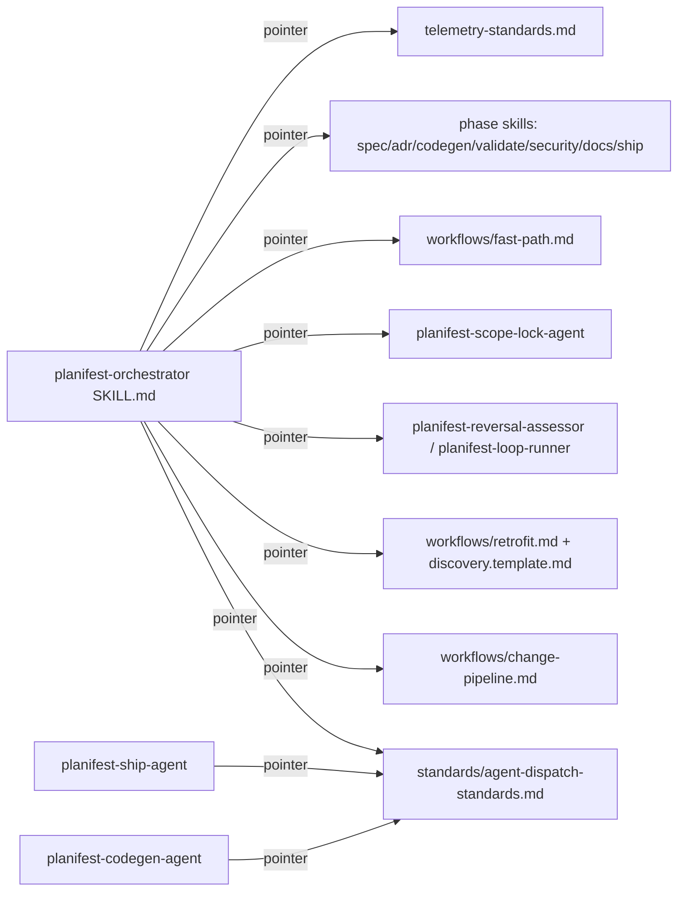

# Execution Plan - orchestrator-redundancy-removal

> Every requirement must be traceable to a user story or acceptance criterion.

**Skill:** [spec-agent](../skills/planifest-spec-agent/SKILL.md)
**Feature:** 0000022-orchestrator-redundancy-removal
**Wave:** n/a (single wave)
**Version:** 0.22.0
**Status:** draft

## Active Skills

None. No capability skills are relevant to a Markdown/Bash framework de-duplication pass.

## Functional Requirements Directory

Functional requirements are split into individual files — one per unit of work — at `plan/current/requirements/`.

| File | Requirement |
|------|------------|
| [req-001-regression-baseline.md](requirements/req-001-regression-baseline.md) | Run the full regression pack and record it, plus current word counts, before any trim edit |
| [req-002-class-1-removals.md](requirements/req-002-class-1-removals.md) | Remove 8 orchestrator sections already correctly stated in a phase skill, workflow, standard, or template |
| [req-003-class-2-relocations.md](requirements/req-003-class-2-relocations.md) | Move the Model Tier Decision Table and Parallelism Rules + Agent Dispatch Template into a new standards file |
| [req-004-class-3-trims-and-test-updates.md](requirements/req-004-class-3-trims-and-test-updates.md) | Trim expository asides; update every regression test that pins moved or removed orchestrator content |
| [req-005-comparison-rerun.md](requirements/req-005-comparison-rerun.md) | Re-run the full regression pack, compare against the baseline, confirm the 7,600-word target |

## Non-Functional Requirements

| ID | Category | Requirement | Target | Measurement |
|----|----------|------------|--------|-------------|
| NFR-001 | Size | Orchestrator skill word count | <= 7,600 words | `wc -w` on `planifest-orchestrator/SKILL.md` after req-005 |
| NFR-002 | Correctness | Zero behavioural change from the trim | Every removed instruction verifiably stated in exactly one canonical file | P4 diff review (named second detector) plus regression-pack comparison |
| NFR-003 | Compliance | Zero enforcement-content loss | 0000021 ADR-002 baseline comparison passes with no regressions | req-005 comparison result |

> No latency, availability, or throughput NFRs apply - this feature has no runtime component.

## API Summary

Not applicable. No API is built or modified by this feature.

## Data Model Summary

Not applicable. No data store is owned or touched by this feature (`planifest-framework/component.yml`: `data.ownsData: false`).

## Component Interactions

## Assumptions

Each is a risk item with likelihood: medium (see `risk-register.md` A-001, A-002).

| ID | Assumption | Impact if Wrong |
|----|-----------|----------------|
| A-001 | Per-section word estimates (~2,900-3,300 removable) are approximate; the 7,600-word ceiling binds | Class 3 trims go deeper, or the ceiling is renegotiated before req-005 |
| A-002 | A new standards file is an acceptable home for relocated model-tier/parallelism content | P2 ADR could select an existing file instead; no scope change |

## Open Questions

None reported to the orchestrator at P1. The Scope Lock Challenge (P0) already resolved the two material gaps found during drafting (the P4-diff-review second-detector closure, and the session-marker commit mandate, filed as backlog 0000030).
