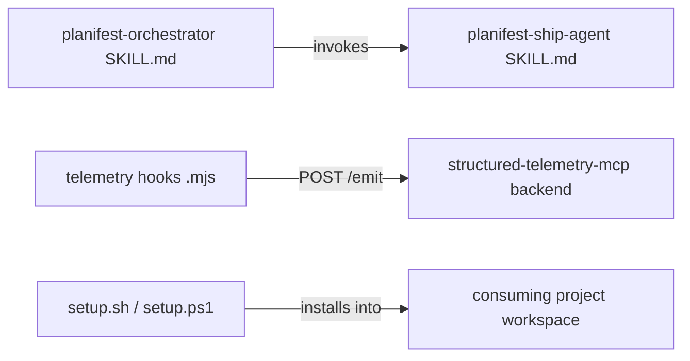

# Execution Plan - Framework Pipeline Fixes

> Every requirement must be traceable to a user story or acceptance criterion.

**Skill:** [spec-agent](../skills/planifest-spec-agent/SKILL.md)
**Feature:** 0000023-framework-pipeline-fixes
**Wave:** 1 (single wave)
**Version:** 0.23.0
**Status:** active

## Active Skills

None.

## Functional Requirements Directory

| File | Requirement |
|------|------------|
| [req-001-continuous-run-p1-p3.md](requirements/req-001-continuous-run-p1-p3.md) | Restore `continuous_run` exception for P1/P2/P3 STOP rules in the Phase Invocation Table |
| [req-002-marker-commit-lifecycle.md](requirements/req-002-marker-commit-lifecycle.md) | Commit session markers at creation (P0) and atomically at deletion (P7), plus a P9 backstop check |
| [req-003-copilot-setup-self-copy-fix.md](requirements/req-003-copilot-setup-self-copy-fix.md) | Fix `TOOL_HOOK_ADAPTER_DEST` self-copy crash in `copilot.sh`/`copilot.ps1`, plus a `setup.ps1` dispatcher-guard bug found while investigating |
| [req-004-telemetry-product-id-emission.md](requirements/req-004-telemetry-product-id-emission.md) | Emit `product_id` from the 3 telemetry hooks and the canonical envelope template |

## Non-Functional Requirements

| ID | Category | Requirement | Target | Measurement |
|----|----------|------------|--------|-------------|
| NFR-001 | Reliability | `setup.sh copilot` and `setup.sh all` must not crash | Exit code 0 on a fresh workspace | New regression test |
| NFR-002 | Performance | `product_id` derivation adds no telemetry latency | `git rev-parse --show-toplevel` stays synchronous, sub-millisecond, before the existing ~3s fetch-abort | Code review; existing fetch-abort budget unchanged |
| NFR-003 | Fault tolerance | Telemetry emission never blocks on a `product_id` derivation failure | Missing `git` binary or non-repo cwd falls back to raw `cwd`, never throws past hook's own try/catch | Regression test (non-git-repo cwd case) |

## API Summary

Not applicable — no API surface in this feature.

## Data Model Summary

Not applicable — no new data stores. Session marker files (`plan/.orchestrator-active`, `plan/.orchestrator-ack`, `plan/.run-mode`) are sentinel dotfiles, not modeled data.

## Component Interactions

## Assumptions

| ID | Assumption | Impact if Wrong |
|----|-----------|----------------|
| A-001 | `planifest-framework/skills/` is the canonical source; `.claude/skills/` is a synced build artifact | Edits would also need to target `.claude/skills/` directly for this session's own orchestrator behavior to reflect the fix immediately |
| A-002 | No `pwsh` runtime is available in this environment | The `copilot.ps1` fix (req-003) would need re-verification if a runtime were actually available and untested |

## Open Questions

None — all four requirements are fully specified with no blocking ambiguity.
