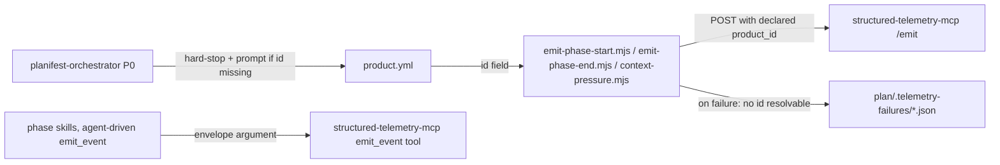

# Execution Plan - Declared Product ID and Telemetry Envelope Fix

**Skill:** [spec-agent](../skills/planifest-spec-agent/SKILL.md)
**Feature:** 0000024-declared-product-id-for-telemetry
**Version:** 0.24.0
**Status:** active

## Active Skills

None — no capability skills relevant to this stack (Markdown + Node hooks + bash tests).

## Functional Requirements Directory

Functional requirements are split into individual files — one user story per file — at `plan/current/requirements/`.

| File | Requirement |
|------|------------|
| [req-001-declared-product-id.md](requirements/req-001-declared-product-id.md) | Delete `getProductId()`/git-path fallback from all 3 telemetry hooks; source `product_id` from `product.yml`'s `id` field only, routing failure to the existing marker mechanism; orchestrator P0 hard-stops and prompts when undeclared |
| [req-002-fix-envelope-parameter.md](requirements/req-002-fix-envelope-parameter.md) | Correct `telemetry-standards.md` and audit all 8 phase skills for the stale `event`→`envelope` `emit_event` argument name; live-reverify at least one agent-driven event lands |

## Non-Functional Requirements

| ID | Category | Requirement | Target | Measurement |
|----|----------|------------|--------|-------------|
| NFR-001 | Correctness | Agent-driven `emit_event` calls during this feature's own pipeline run must use the correct `envelope` argument and succeed | 100% of phases record Telemetry = `emitted`, zero `failed-with-recorded-choice` | Build log Telemetry field per phase |
| NFR-002 | Data integrity | No telemetry event may carry a filesystem-path `product_id` after this feature ships | Zero occurrences, verified by regression test | `grep` for path-shaped values in test assertions; regression test suite |
| NFR-003 | Backward compatibility | Hooks must never hard-block the session regardless of `product.yml` state, even without a path fallback | Existing ADR-005 behaviour (exit-zero, never blocks) unchanged | Regression test asserts exit code 0 in all 4 hook scenarios |

> "The system should be fast" is not a requirement. Each target above is a specific, testable assertion.

## API Summary

Not applicable — no API surface. `planifest-framework` is a component-pack (prose skills, hook scripts, setup scripts), not an API provider. OpenAPI specification omitted per spec-agent's critical condition.

## Data Model Summary

The full schema is documented here rather than a separate data contract, consistent with feature 0000023's precedent (no schema-owning changes warranting a formal data contract).

| Entity | Owner Component | Key Fields | Relationships |
|--------|----------------|------------|--------------|
| `product.yml` | planifest-framework | `id` (new required role — canonical declared product_id), `name`, `version`, `versionPolicy`, `components` (existing fields, unchanged) | Read by: all 3 telemetry hooks, orchestrator P0 step 3b, any agent-driven `emit_event` call |
| `plan/.telemetry-failures/*.json` | planifest-framework | `hook`, `root_cause_key`, `error_type`, `error_message`, `phase`, `session_id`, `first_seen`, `last_seen`, `occurrences` (all pre-existing fields, 0000018 — reused as-is, no new marker shape) | Written by: 3 telemetry hooks on emission failure, including unresolvable `product_id` |

## Component Interactions

## Assumptions

| ID | Assumption | Impact if Wrong |
|----|-----------|----------------|
| A-001 | `structured-telemetry-mcp`'s `emit_event` fix (real object schema, `envelope` argument) is stable/deployed, not transient | req-002's live re-verification step fails immediately and visibly — not silent |
| A-002 | Every pipeline run has an orchestrator-led P0 phase, so a once-per-run hard-stop prompt is sufficient coverage | A hook-only invocation with no prior P0 hits the failure-marker path instead of the prompt — the designed fallback, not a gap |

## Open Questions

None — all material gaps were resolved during P0 coaching and the Scope Lock Challenge (see `plan/current/build-log.md`).
