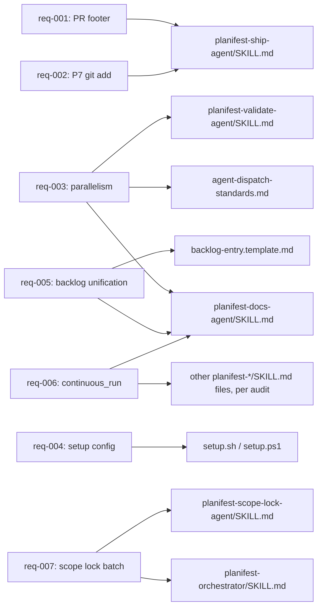

# Execution Plan - 0000025-pipeline-gate-and-config-fixes-and-ship-agent-fixes

> Every requirement must be traceable to a user story or acceptance criterion.

**Skill:** [spec-agent](../../.claude/skills/planifest-spec-agent/SKILL.md)
**Feature:** 0000025-pipeline-gate-and-config-fixes-and-ship-agent-fixes
**Wave:** not applicable — not a waved feature
**Version:** 0.25.0
**Status:** draft

## Active Skills

None — per `design.md` Active Skills: "no capability skills relevant to this stack (Markdown + Node hooks + Bash scripts)." Downstream phase skills that implement these requirements (`planifest-codegen-agent`, `planifest-adr-agent`, `planifest-validate-agent`) are listed in `design.md`'s Skill Map and are not repeated here.

## Functional Requirements Directory

Functional requirements are split into individual files — one user story per file — at `plan/current/requirements/`.

| File | Requirement |
|------|------------|
| [req-001-ship-agent-pr-footer.md](requirements/req-001-ship-agent-pr-footer.md) | Ship-agent PR description template omits the AI-attribution footer by default (Step 10, both push options) |
| [req-002-ship-agent-p7-git-add.md](requirements/req-002-ship-agent-p7-git-add.md) | P7 archive commit's `git add` explicitly names `plan/current/` instead of relying on rename-detection |
| [req-003-subagent-parallelism-expansion.md](requirements/req-003-subagent-parallelism-expansion.md) | Parallel-dispatch guidance for independent, non-cross-referencing writes extended beyond P1/P3 to P4 and P6 |
| [req-004-setup-config-relocation.md](requirements/req-004-setup-config-relocation.md) | Active setup flags/backend-url additionally recorded in a versioned `planifest-overrides/setup-config/` file per tool |
| [req-005-backlog-unification.md](requirements/req-005-backlog-unification.md) | `recommendations.md`'s Deferred Items and Tech Debt rows also filed as tagged `plan/backlog/` entries |
| [req-006-docs-agent-continuous-run.md](requirements/req-006-docs-agent-continuous-run.md) | Docs-agent P6 Gate B (and any phase skill with the same pattern) checks `continuous_run` before stopping for confirmation |
| [req-007-scope-lock-default-drafted-batch.md](requirements/req-007-scope-lock-default-drafted-batch.md) | Scope Lock Challenge defaults to drafting all four scenario-path answers in parallel and presenting them in one batch |

## Non-Functional Requirements

| ID | Category | Requirement | Target | Measurement |
|----|----------|------------|--------|-------------|
| NFR-001 | Pipeline efficiency (US-003) | Independent, non-cross-referencing writes within a phase batch dispatch in parallel subagents, not sequentially | 100% of phase batches with 2+ independent, non-cross-referencing writes dispatch in parallel | The existing `Parallel task batches` field already tracked per phase in `build-log.md` — no new schema, per `design.md` Architecture Layer and req-003's acceptance criteria |
| NFR-002 | Security | No new attack surface is introduced by any of the seven fixes | Zero new auth/authz surface, external inputs, or trust boundaries across all seven changed files | P5 security review of the diff confirms all changes touch only trusted, human-reviewed skill/script/standard files in this repo |
| NFR-003 | Data privacy | No regulated or personal data is touched by any of the seven fixes | Zero data stores read, written, or newly modeled | P2 review confirms no data contract is created or modified (see Data Model Summary below) |
| NFR-004 | Observability | Existing `telemetry-standards.md` conventions apply unchanged to any new agent-driven events these fixes touch (e.g. docs-agent Gate B auto-accept logging under req-006, backlog entry filing under req-005) | Any new agent-driven event emitted as a result of these fixes conforms to the existing event envelope — no new envelope fields | P5 review checks new/changed event emissions against `planifest-framework/standards/telemetry-standards.md` |
| NFR-005 | Availability / Scalability / Cost | Not applicable — pipeline tooling, not a runtime service | N/A (no deployment topology, no compute/storage/egress delta) | N/A |

> "The system should be fast" is not a requirement. NFR-001's target is specific because US-003's acceptance criteria pin it to an existing, already-tracked `build-log.md` field.

## API Summary

**This feature has no API.** All seven requirements are internal framework-tooling fixes — edits to skill files (`.claude/skills/planifest-*/SKILL.md`), standards docs (`planifest-framework/standards/`), templates (`planifest-framework/templates/`), and setup scripts (`setup.sh`, `setup.ps1`). No HTTP endpoint, CLI surface, or service contract is introduced or modified by any requirement. No `openapi-spec.yaml` is produced for this feature, per `design.md` Architecture Layer ("API versioning: not applicable") and the spec-agent's own condition to omit OpenAPI generation when no API is built or modified.

## Data Model Summary

**This feature owns no data.** Per `design.md` Engineering Layer: "Data ownership: not applicable — no data stores touched." None of the seven requirements creates, modifies, or reads a database schema, table, or persisted entity. No `src/{component-id}/docs/data-contract.md` is produced for this feature.

## Component Interactions

No runtime component interactions exist for this feature (no API, no data, no deployed service). The diagram below instead shows which framework file(s) each requirement touches, for review clarity:

## Assumptions

Each is a risk item with likelihood: medium.

| ID | Assumption | Impact if Wrong |
|----|-----------|----------------|
| A-001 | The two downstream-filed backlog entries (0000040, 0000041) reflect real friction in a genuine Planifest deployment | Low — both are independently corroborated by this repo's own history (0000029, filed by feature 0000016) and by direct human confirmation at P0, per `design.md` Assumptions |

## Open Questions

Reported to the orchestrator - not filled in by assumption. Each is a hard dependency on a P2 ADR decision, per the corresponding requirement's own Dependencies section.

| ID | Question | Blocking |
|----|----------|----------|
| Q-001 | What exact opt-in mechanism/instruction (in `planifest-overrides/instructions/`) restores the PR-attribution footer? | req-001 implementation — the conditional-inclusion logic cannot be finalized without this ADR decision |
| Q-002 | When `planifest-overrides/setup-config/{tool}.md` and the gitignored `.planifest-setup-flags` marker disagree, which takes precedence, and does this extend to `.orchestrator-strict`? | req-004 implementation — reconciliation behavior is undecided per backlog entry 0000037 and deferred to the P2 ADR |
| Q-003 | Do `recommendations.md`'s Deferred Items/Tech Debt tables become thin pointers into the new `plan/backlog/` entries, or are they retired outright? | req-005 implementation — affects whether `recommendations.template.md` needs a pointer-column change |
| Q-004 | What is the text of the new ADR superseding/amending `0000017-ADR-003`, scoped narrowly against `0000014-ADR-008`, that authorizes the Scope Lock Challenge's default-drafted, batch-presented behavior? | req-007 implementation — cannot ship without this ADR, per req-007's Dependencies and `design.md` Risks |
