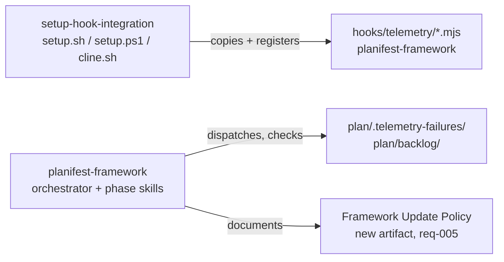

# Execution Plan - backlog-batch-governance-tooling-fixes

> Every requirement must be traceable to a user story or acceptance criterion.

**Skill:** [spec-agent](../skills/planifest-spec-agent/SKILL.md)
**Feature:** 0000027-backlog-batch-governance-tooling-fixes
**Wave:** single wave (not waved — see design.md)
**Version:** 0.27.0
**Status:** active

## Active Skills

None — skills-inbox empty, no capability skills installed for this run.

## Functional Requirements Directory

Functional requirements are split into individual files — one user story per file — at `plan/current/requirements/`.

| File | Requirement |
|------|------------|
| [req-001-wire-telemetry-hooks.md](requirements/req-001-wire-telemetry-hooks.md) | Wire phase_start/phase_end telemetry hooks into setup.sh/setup.ps1 alongside context-pressure.mjs (0000043) |
| [req-002-fix-cline-path-collision.md](requirements/req-002-fix-cline-path-collision.md) | Fix cline.sh/cline.ps1 boot-file/skills-dir path collision (0000034) |
| [req-003-subagent-backlog-filing.md](requirements/req-003-subagent-backlog-filing.md) | Dispatched subagents file out-of-scope discoveries to plan/backlog/, not spawn_task (0000035) |
| [req-004-telemetry-compliance-backstop.md](requirements/req-004-telemetry-compliance-backstop.md) | Deterministic backstop for telemetry-failure-marker checks and agent-driven emit_event verification (0000044) |
| [req-005-framework-update-p0-flow.md](requirements/req-005-framework-update-p0-flow.md) | Explicit P0 flow distinguishing a framework dependency update from an arbitrary code push (0000046) |
| [req-006-backfill-historical-backlog.md](requirements/req-006-backfill-historical-backlog.md) | One-time backfill of pre-0000025 recommendations.md deferred items/tech debt into plan/backlog/ (0000045) |
| [req-007-skill-scope-adr.md](requirements/req-007-skill-scope-adr.md) | Skill-scope-principle ADR with 4 worked examples (0000024) — deliverable produced at P2 |
| [req-008-minimal-artifact-set.md](requirements/req-008-minimal-artifact-set.md) | Minimal default Phase 1 artifact set with explicit trigger conditions (0000021) |

## Non-Functional Requirements

| ID | Category | Requirement | Target | Measurement |
|----|----------|------------|--------|-------------|
| NFR-001 | Reliability | `setup.sh`/`setup.ps1` complete on a fresh workspace for every tool target, including `cline` and `all` | Exit code 0 | Regression test (req-002 AC) |
| NFR-002 | Observability | Every phase transition emits `phase_start`/`phase_end` when the unified telemetry signal is active | 100% of phase transitions register a hook entry | Hook-registration presence check (req-001 AC) |

## API Summary

Not applicable — this feature modifies no API surface (no OpenAPI spec produced, per the confirmed design and req-008's own minimal-artifact-set trigger: OpenAPI is conditional on the component acting as an API provider, which none of these 8 items do).

## Data Model Summary

Not applicable — no runtime data stores are created or modified. All 8 items change the framework's own files (scripts, skills, docs, ADRs, backlog entries).

## Component Interactions

## Assumptions

Each is a risk item with likelihood: medium — see `risk-register.md`.

| ID | Assumption | Impact if Wrong |
|----|-----------|----------------|
| A-001 | req-004's and req-005's exact mechanisms (resolved by P2 ADRs) will not require re-opening their requirement docs | A second requirements pass would be needed for that item only, not the full batch |
| A-002 | Ops model/cost model/SLO definitions are N/A for this feature (zero deployed runtime footprint) | None identified — this feature has no deployed service regardless of which artifact-set rule eventually governs it |

## Open Questions

Reported to the orchestrator — not filled in by assumption. Both are explicitly deferred to P2 ADRs per the confirmed design's own risk register.

| ID | Question | Blocking |
|----|----------|----------|
| Q-001 | Does req-004's telemetry-compliance backstop use a hook, a phase-gate lint/check, or both? | req-004's P3 implementation |
| Q-002 | Does req-005's Framework Update Policy mechanism extend `planifest-migrator`, or introduce a new dedicated agent? | req-005's P3 implementation |
