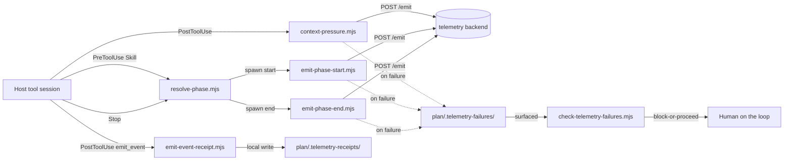

# Execution Plan - telemetry-hardening-and-enforcement-fixes

> Every requirement must be traceable to a user story or acceptance criterion.

**Skill:** [spec-agent](../../planifest-framework/skills/planifest-spec-agent/SKILL.md)
**Feature:** 0000028-telemetry-hardening-and-enforcement-fixes
**Wave:** single wave
**Version:** 0.28.0
**Status:** active

## Active Skills

| Skill | Scope | Purpose |
|-------|-------|---------|
| planifest-refresh-setup | plan | Reconstructs the setup flags in effect and re-invokes `setup.sh`, which REQ-004 needs |
| planifest-verify-by-execution | plan | Loaded by the P4 validate-agent; REQ-005 cannot be satisfied by reading test output |

No capability skills installed. Playwright MCP was checked at P0 and is unavailable both in this session's
tool set and in the connector registry; it is filed as backlog `0000064`.

## Functional Requirements Directory

Functional requirements are split into individual files, one user story per file, at
`plan/current/requirements/`.

| File | Requirement |
|------|------------|
| [req-001-bounded-retry-network-failures.md](requirements/req-001-bounded-retry-network-failures.md) | Bounded retry on network-level emission failures, never on an HTTP error status |
| [req-002-shared-module-extraction.md](requirements/req-002-shared-module-extraction.md) | Extract duplicated hook logic into shared modules, fixing a latent `readStdin()` hang |
| [req-003-stderr-fallback-on-marker-write-failure.md](requirements/req-003-stderr-fallback-on-marker-write-failure.md) | One stderr line when the durable marker write itself fails |
| [req-004-install-refresh-phase-hook-registration.md](requirements/req-004-install-refresh-phase-hook-registration.md) | Refresh the stale install so phase hooks register; gitignore telemetry receipts |
| [req-005-live-verification-resolve-phase-and-schema.md](requirements/req-005-live-verification-resolve-phase-and-schema.md) | Verify `resolve-phase.mjs` against a live hook firing, and the schema's loop and reversal fields |
| [req-006-em-dash-write-time-guard-and-cleanup.md](requirements/req-006-em-dash-write-time-guard-and-cleanup.md) | Write-time em dash guard, plus a bounded cleanup of live artifacts |

Traceability: REQ-001 to US-001, REQ-002 to US-002, REQ-003 to US-003, REQ-004 to US-004, REQ-005 to US-005,
REQ-006 to US-006. All six user stories are in `design.md`.

**Dependency order.** REQ-002 must land before REQ-001 touches a shared emit path, because a half-applied
extraction degrades to a silent no-op. REQ-004 must complete before REQ-005, because nothing can be observed
firing until the hooks are registered. REQ-003 and REQ-006 are independent of the rest.

## Non-Functional Requirements

| ID | Category | Requirement | Target | Measurement |
|----|----------|------------|--------|-------------|
| NFR-001 | Reliability | A hook never blocks the host session and exits 0 on every path, including retry exhaustion, marker write failure, and stdin stream error | 100 percent of paths | Asserted by test per hook; the stdin path is currently violated in 10 of 12 hooks and is fixed under REQ-002 |
| NFR-002 | Reliability | No queue, buffer, or deferred delivery is introduced. A failure is still dropped and still recorded | zero persistence of undelivered events | Code review at P5 |
| NFR-003 | Performance | Retry adds no more than 600ms worst case, on top of the existing 3s per-attempt abort | 600ms | Timed hook invocation against a backend that never listens |
| NFR-004 | Correctness | A backend that is genuinely down produces exactly one durable marker, neither zero nor many | exactly 1 | Test with no listener present throughout |
| NFR-005 | Correctness | A listener appearing partway through the retry window delivers the event and writes no marker | 0 markers | Test with a listener bound mid-window |
| NFR-006 | Correctness | An HTTP 4xx or 5xx is never retried | 1 attempt only | Test with a backend returning 500 |
| NFR-007 | Security | Marker and receipt files stay out of version control, since they may echo user-configured URL and error strings verbatim | both paths gitignored | `git check-ignore` assertion |
| NFR-008 | Maintainability | Each extracted helper exists in exactly one place | 1 definition per helper | Static count at P4 |

## API Summary

Not applicable. No component in this feature acts as an API provider. The telemetry hooks are HTTP clients of
an external backend that is outside this repo and unmodifiable here. No `openapi-spec.yaml` is produced, per
the spec-agent's critical condition.

## Data Model Summary

No database and no schema. Two file-based artifacts carry a defined shape:

| Entity | Owner Component | Key Fields | Relationships |
|--------|----------------|------------|--------------|
| Durable failure marker | `planifest-framework` | `hook`, `root_cause_key`, `error_type`, `error_message`, `phase`, `session_id`, `first_seen`, `last_seen`, `occurrences` | One file per distinct `root_cause_key`; a repeat increments `occurrences` rather than creating a new file |
| Telemetry receipt | `planifest-framework` | written by `emit-event-receipt.mjs` per successful `emit_event` call | Cross-referenced by `check-telemetry-receipts.mjs` against build-log per-phase telemetry claims |

Neither warrants a data contract document: there is no schema ownership question, no migration path, and no
second component writing to either.

## Component Interactions

The three hooks with a solid line to the backend are the three that call `fetch` and therefore the three that
REQ-001 changes. `resolve-phase.mjs` reaches the backend only transitively, through the hooks it spawns.

## Assumptions

Each is a risk item with likelihood medium. Full entries in `risk-register.md`.

| ID | Assumption | Impact if Wrong |
|----|-----------|----------------|
| A-001 | `resolve-phase.mjs`'s `PreToolUse(Skill)` matcher and `tool_input.skill` field assumption are correct | REQ-005 becomes a fix rather than a verification, expanding P3 |
| A-002 | The `0000063` retry budget of 2 attempts at 300ms is appropriate for this repo, not just the downstream one | Budget needs re-derivation; the network-versus-HTTP distinction holds regardless |
| A-003 | The em dash cleanup can be applied to live artifacts without altering meaning | A replacement changes the sense of a sentence; P4 diff review must catch it |
| A-004 | `getSessionId()`'s three behaviour profiles are intentional rather than drift | Excluding it from consolidation preserves a bug instead of a feature |

Resolved and no longer assumptions: `--structured-telemetry-mcp` is confirmed present in
`.claude/.planifest-setup-flags`, so REQ-004's precondition holds as verified fact.

## Open Questions

| ID | Question | Blocking |
|----|----------|----------|
| Q-001 | The em dash guard needs a bypass mechanism. `commit-msg` uses `git commit --no-verify`, which has no equivalent for a `PreToolUse(Write/Edit)` hook. REQ-006 proposes an in-content sentinel modelled on the `.ratchet-approve` precedent. Confirm at P3. | REQ-006 implementation only |
| Q-002 | Should the `readStdin()` NFR-001 fix be verified across all 12 hooks, or only the telemetry ones this feature otherwise touches? | REQ-002 test scope |
