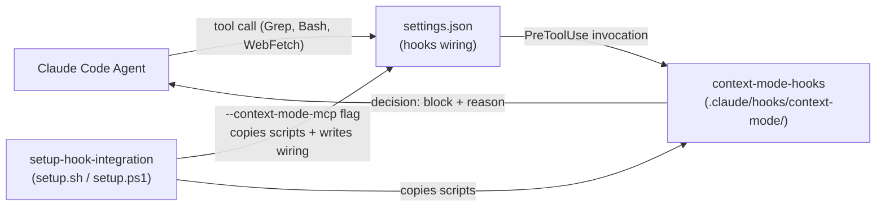

# Execution Plan - context-mode Enforcement Hooks

> Written by the spec-agent. Derived from the Feature Brief - not invented. Every requirement must be traceable to a user story or acceptance criterion.

**Skill:** spec-agent
**Tool:** claude-code
**Model:** claude-sonnet-4-6
**Feature:** 0000001-context-mode-enforcement-hooks
**Version:** 0.1.0
**Status:** draft

---

## Functional Requirements Directory

Functional requirements are split into granular files to optimise agent context windows.

See `plan/current/requirements/` for individual feature requirements.
*Each file follows the [Requirement Template](../../planifest-framework/templates/requirement.template.md).*

| Req ID | Title | Source |
|--------|-------|--------|
| REQ-001 | Grep blocking hook | User story 1, AC-1 |
| REQ-002 | Bash pattern blocking hook | User story 2, AC-2 |
| REQ-003 | WebFetch blocking hook | User story 1, AC-3 |
| REQ-004 | Setup integration — flag installs hooks | User story 3, AC-4, AC-5, AC-6 |

---

## Non-Functional Requirements

| ID | Category | Requirement | Target | Measurement |
|----|----------|-------------|--------|-------------|
| NFR-001 | Performance | Hook execution overhead per intercepted tool call | < 50ms | Wall-clock time from stdin receipt to stdout decision, measured via `time` in shell test |

---

## API Summary

Not applicable. This feature produces no HTTP endpoints. It produces bash scripts (hook executables) and JSON configuration (settings wiring). No OpenAPI specification is generated.

---

## Data Model Summary

Not applicable. Hook scripts are stateless stdin → stdout processors. No data is persisted, no tables are created, no schema is modified.

---

## Component Interactions



---

## Assumptions

| ID | Assumption | Impact if Wrong |
|----|-----------|----------------|
| A-001 | Claude Code `settings.json` supports `PreToolUse` hooks with `{"decision":"block","reason":"..."}` stdout output | Hook mechanism needs full redesign |
| A-002 | Hook scripts are invoked as bash on all platforms where Claude Code runs (macOS, Linux, Windows with bash available) | Windows needs `.ps1` equivalents — deferred |
| A-003 | The `reason` field in the block decision is surfaced to the agent verbatim (not truncated or suppressed) | Block messages cannot name the specific `ctx_*` redirect tool, defeating the requirement |

---

## Open Questions

*All open questions resolved via Claude Code hooks documentation.*

| ID | Question | Resolution |
|----|----------|-----------|
| Q-001 | Exact JSON schema for `settings.json` hook entry | **Resolved.** `matcher` = tool name string. Output uses `hookSpecificOutput.hookEventName / permissionDecision / permissionDecisionReason` — NOT top-level `decision`/`reason` (those are deprecated for PreToolUse). `permissionDecision` values are `"allow"` or `"deny"`. Hook config also supports an `if` field for inline pattern pre-filtering (e.g. `"if": "Bash(grep *)"`) to avoid spawning scripts unnecessarily. |
| Q-002 | Does the hook receive the full tool input on stdin? | **Resolved.** Yes — hook stdin is a JSON object with `tool_name`, `tool_input` (full), plus `session_id`, `cwd`, `hook_event_name`. For Bash: `tool_input.command` contains the command string. Bash pattern matching is fully implementable. |

### Corrected Output Format (supersedes design.md assumed format)

Hook scripts must output:
```json
{
  "hookSpecificOutput": {
    "hookEventName": "PreToolUse",
    "permissionDecision": "deny",
    "permissionDecisionReason": "<redirect message naming the ctx_* replacement>"
  }
}
```
Exit 0. No stdout other than this JSON object.

Allow (pass-through) = exit 0 with no output, or `permissionDecision: "allow"`.

---

*Generated by spec-agent.*
